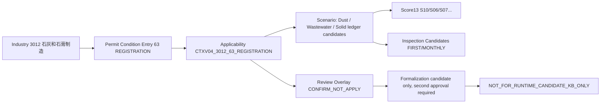
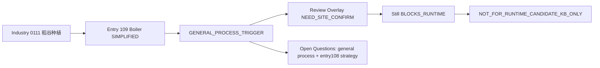
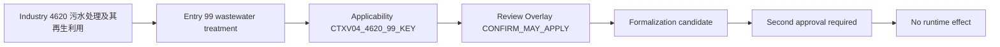
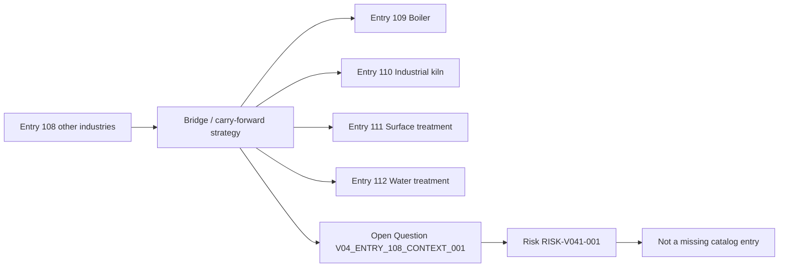

# graph_visualization_samples_v0_9

final_state: `NOT_FOR_RUNTIME_CANDIDATE_KB_ONLY`

全局提示：以下可视化展示的是候选影响范围传播，不代表企业现场事实已确认适用，不产生运行时效果。

## 3012 登记管理确认不适用

## 0111 锅炉通用工序仍需现场确认

## 4620 第99条确认为候选仍需二次审批

## Entry 108 承接策略

